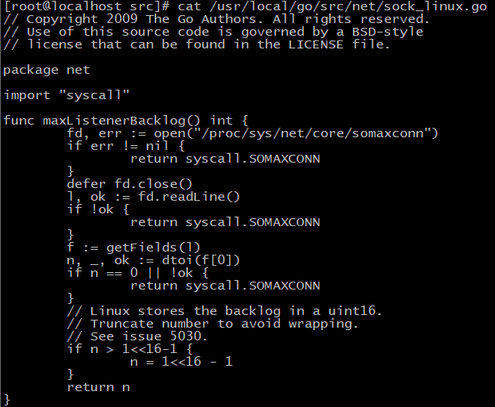

Go是一门表达力强，简洁，干净，有效的编程语言，它特有的并发机制使得其能够更为容易的编写充分利用多核机器性能的程序。用Go写一个高并发的server与基于I/O多路复用模型的server，在思路和处理细节上有诸多不同。本篇文章通过编写一个完整可用的例子，来描述如何使用Go编写tcp server。

# 概念
## 多路复用模型
在Linux上基于I/O多路复用模型的server，大体是这样的
```c
int main() {
	listen()
	epoll_create()
	epoll_ctrl()
	while(1) {
		eventNum = epoll_wait()	
		while(eventNum > 0) {
			handleEvent()
			eventNum--
		}
	}
}
```
本质上是事件循环，系统在对应端口上捕获到的事件，均会被放入事件列表，程序编写者需要循环处理这份列表，根据具体的事件进行相应的回调处理。其中epoll_wait可传入时间参数以设定其在等待事件的空窗时间。整个模型循环在一个os进程中，若要利用多核性能，就必须加入多进程和多线程的处理，通常这部分会比较复杂。一些通用的做法是，判断若是读事件，使用main thread去recv数据，raw数据丢到mq，多个worker thread从mq上读取raw数据进行解析并处理。但凡涉及到多进程多线程，就不可避免地需要考虑共享资源的使用，也就不可避免地使用到锁。锁是特别会增加程序员心智负担的一个东西，稍不注意就造成系统锁死，bad guy。所以写过C再写Erlang和Go的时候就会很开心。另外，thread的监控也会比较头疼，若worker thread异常退出，该如何处理？若要通知其他worker thread退出，也很麻烦。

## Go模型
使用Go时，server模型大体是这样的：
```golang?linenums
func main() {
	ln, _ := net.Listen()
	for {
		conn, _ := ln.Accept()
		go handleConn(conn)
	}
}
```
这里最关键的一行line5，关键字go就已经完成了对多核特性的支持。Go将I/O多路复用模型封装在runtime里了，底层的事件再不需要开发者注册和回调。go程并不是一个OS线程，它更为轻量级，这里引用[The Go scheduler](http://morsmachine.dk/go-scheduler)的几张图说明:


>- M表示OS线程。
>- G表示goroutine，包含独有的stack，指令指针及一些调度信息。
>- P表示一个处于调度的上下文，视作一个局部调度器，用来将goroutine绑定到一个具体的线程上。这是Go从N:1调度器到M:N调度器的关键。


>Go1.5以上的版本，P被默认为CPU core的数量。
>灰色的G被维护在一个队列里等待被调度，Go在syscall被调用之前，会将P和原本的M0解绑，重新寻找空闲的M1绑定，以便在M0阻塞时还能同时处理队列中的其他G。


>当某个P的G队列跑完了，而其他P队列还有G，会尝试进行steal操作，获取其他P的G，保证所有M能够全负荷运行。

goroutine相比thread更为轻量，一个Go程序中可以并发成千上万个goroutine的系统调度和资源占用开销会更小。但有了goroutine，并不代表就不需要处理共享数据和资源，在Go哲学里，强调的是：
>不要通过共享内存来通信，而要通过通信来共享内存。

理论上来说，我们只需要三类goroutine即能完成一个简单的模型。

- 主协程：完成Listen，等待退出信号，然后向所有加入WaitGroup的goroutine发送退出消息。
- Accept协程：完成Accept动作。
- Handler协程：处理socket连接上的读写事件。
但在实际应用中，由于网络IO的存在，仅仅handler协程是无法同时处理socket连接上读写的，所以还必须再多两个协程分别将读写IO分离出去。
- Read协程：从socket读取数据，解析，处理。
- Send协程：将准备好的数据发送到socket。
- Handler协程的职责改为，创建Recv和Send协程，将他们放入WaitGroup作为整体管理，同生共死。

```golang?linenums
func main() {
	ln, err := net.Listen("tcp", ":8000")
	if err != nil {                      
		fmt.Println(err)                 
		return                           
	}    
	
	ctx, cancel := context.WithCancel(context.Background())
	// Accept协程
	go func() {                                            
		for {                                              
			conn, err := ln.Accept()                       
			if err != nil {                                
				fmt.Println(err)                           
				continue                                   
			}                                              

			handler(ctx, conn)                             
		}                                                  
	}()  
	
	quit := make(chan os.Signal, 1)        
	signal.Notify(quit,                    
		syscall.SIGINT,                    
		syscall.SIGTERM,                   
		syscall.SIGQUIT,                   
	)                                      
	select {                               
	case <-quit:                           
		{                                  
			fmt.Println("recv quit signal")
			cancel()                       
		}                                  
	}                                      
}

func handler(topCtx context.Context, conn net.Conn) error {
    ctx, cancel := context.WithCancel(context.Background())
    group, newCtx := errgroup.WithContext(ctx)             
                 
	// read协程
    group.Go(func() error {                                
        return readRoutine(topCtx, newCtx, cancel, conn)   
    })                                                     
        
	// send协程
    group.Go(func() error {                                
        return sendRoutine(topCtx, newCtx, cancel, conn)   
    })                                                     
    if err := group.Wait(); err != nil {                   
        fmt.Println(err)                                   
    }                                                      
    return nil                                             
}                                                          
```

## 同步
要完成一个tcp server服务，主要依赖[net](https://golang.org/pkg/net)，[errgroup](https://godoc.org/golang.org/x/sync/errgroup)，[context](https://golang.org/pkg/context)，[sync](https://golang.org/pkg/sync/)包。除net包外，其余都与同步有关。

### **channel**
channel作为Go的同步机制，通过传递数据结构的引用来完成goroutine之间的通信，传递的是数据的所有权，无需上锁。
channel在使用上类似mq，channel可以指定容量，当某个channel上被未读数据占满时，向其写入的goroutine会被阻塞。相反，channel为空时，读取的goroutine也会被阻塞。以下代码，容量为0的channel与阻塞操作无异。
```golang?linenums
mq chan int
mq = make(int)	// mq
// mq = make(int, 100)
// goroutine1
go func() {
	for {
		select {
			case msg:= <- mq:
			time.Sleep(time.Minute)
		}
	}
}()
// goroutine2
go func() {
	for {
		mq <- 1
	}
}
```

goroutine在启动后，除非自己退出，否则不能被停止的，唯一的方法就是通过channel，当然实现起来也很容易。
```golang?linenums
func main() {
	done := make(chan int, 1)
	go func() {
		// do sth.
		// 通知主进程退出
		done <- 0
	}()
	
	select {
	case <- done:
		// quit
	}
}
```
以往的thread通信机制，常用的那几种，不管是消息队列，还是共享内存，使用和维护起来还是比较复杂的，尤其是对于锁的争用。

### **channel tips**
>+ 在使用channel时，尽量由生产者一方关闭channel，消费者判断channel是否被关闭。
```golang
// 消费者
msg, ok := <-channel
if !ok {
	// channel已被关闭
}
```
>+ 若不得已由消费者关闭channel，则生产者必须使用recover捕获异常。但使用额外的channel或者WaitGroup处理是更好的选择。
```golang
// 生产者1
func SafeSend() error {
	defer func() {
		if err := recover(); err != nil {
			// do sth.
		}
	}()
	...
}

// 生产者2
func SafeSend2(ctx context.Context, cancel context.CancelFunc) error {
	defer func() {
		cancel()
	}
	for {
		select {
			case <-ctx.Done():
	...
}
```
>+ 若有必要，考虑使用select超时机制，以保持系统一定程度可用。
```golang
func SendTimout(ch chan<- []byte, msg []byte) error{
	select {
	case ch <- msg:	// 假如ch容量已满，开始阻塞
		// do sth.
	case <-time.After(time.Second):
		// timeout then do sth.
	}
}
```

### WaitGroup
为了知道我们启动的最后一个goroutine什么时候结束，需要一个特殊的计数器，这个计数器在每个goroutine启动时加一，在退出时减一，在完全为零之前等待，并且支持多个goroutine同时操作，sync.WaitGroup就是这种特殊的计数类型。
```golang?linenums
func testGroup() {
	var wg sync.WaitGroup
	wg.Add(1)
	go func() {
		defer wg.Done()
		time.Sleep(time.Second)
	}()
	wg.Wait()
}
```
testGroup函数的wg.Wait会持续等待，直到wg.Done被调用。

在Accept一条连接创建goroutine去服务时，需要注意两件事
+ 使用sync.WaitGroup来对因这条连接而产生的goroutine进行等待和计数。[errgroup](https://godoc.org/golang.org/x/sync/errgroup)包的接口将goroutine启动和退出的加减计数做了封装，看起来更加简洁。

+ 处理由于group里某个goroutine退出时对其他goroutine的通知。[context](https://golang.org/pkg/context)包定义了context类型，在跨API边界和goroutine之间传递deadlines、cancelation signals和其他请求作用域值。

```golang?linenums
ctx, cancel := context.WithCancel(context.Background())
group, newCtx := errgroup.WithContext(ctx)             
group.Go(func() error {         
   select {
   	case <- newCtx.Done():
		fmt.Println("quit")
   }
})     
cancel()
if err := group.Wait(); err != nil {
	// check error
}
```
cancel的调用本质是向(*context.Context).Done塞入一条struct{}消息，而每个goroutine通过select监听(*context.Context).Done，只要从这条channel过来的消息，就可以看作是退出通知，处理好自己的收尾工作然后退出。
(*errgroup.Group) Wait会返回nil或者第一个非nil的值，用于做错误的处理和判断。

## 网络
net.Listen会被动打开一个端口，当有连接访问，会先被放入到listen backlog队列，执行一次Accept操作会从backlog队列中取出一个连接。backlog的size被设定成SOMAXCONN，可通过sysctl -a|grep somaxconn查看，SOMAXCONN在ubuntu中是128。

在实际使用中，除非Accept操作太慢，否则不需要干预。

Go net包的网络相关接口都是blocking的，不过底层依然epoll+Non-blocking，整个核心实现基本都在源码/usr/local/go/src/runtime/netpoll.go里，wait socket io的同时将G挂起，直到io ready后G在重新被放入队列等待调度。

>突破资源的限制
>+ ulimit命令提供对shell和进程的可用资源的限制。可以在/etc/profile，~/.bash_profile 设置ulimit。
>+ limits.conf提供对用户会话的可用资源限制。位置/etc/security/limits.conf。
>+ 设置sysctl.conf提高Linux的性能。位置/etc/sysctl.conf，详细设置可以参考其他人的模板，更详细的可以查看[linux手册](https://github.com/torvalds/linux/tree/master/Documentation/sysctl)。

socket上的数据均为stream，即字节序列，如同水管中的水一样没有明确的边界，没有可见的包或者分组，无法准确的预测是否在一个特定的读操作会返回多少字节，所以必须在获得数据后对字节序列进行拆包，封包，然后提交给应用逻辑处理。

对流式数据处理，就类似于用固定的容器从水管中接水，接满一杯就如同获取一个完整的逻辑数据包。制定数据交换格式，就如同给水杯定大小定容量。
简单的格式可以是这样：
```golang
type message struct {
	size int		// content的大小
	content string	// 内容
}
```
复杂的格式可以是IDL(Interface description language)，例如[json](https://www.json.org/)，[protobuf](https://developers.google.com/protocol-buffers/)等。

在处理流式数据时多考虑两个问题：1）未满时等待；2）溢出时缓存。
```golang?linenums
// 设置io超时时间
conn.SetReadDeadline(time.Now().Add(timeout))   
sizebuf := make([]byte, 4)
// 用io.ReadFull获取确切长度的数据
n, err := io.ReadFull(conn, sizebuf) 
if nerr, ok := err.(net.Error); ok && nerr.Timeout() {
	// do timeout
}
```


