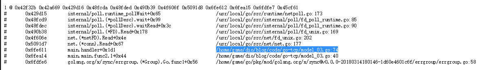
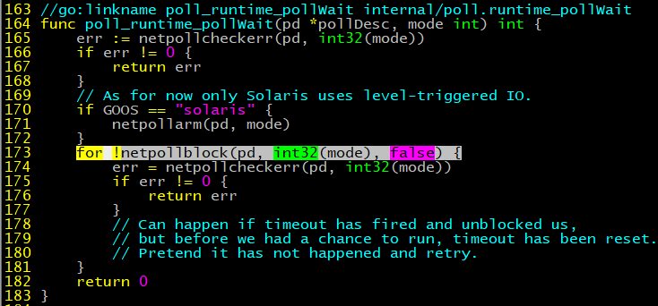

Go是一门表达力强，简洁，干净，有效的编程语言，它特有的并发机制使得其能够更为容易的编写充分利用多核机器性能的程序。用Go写一个高并发的server与基于I/O多路复用模型的server，在思路和处理细节上有诸多不同。本篇文章通过编写一个完整可用的例子，来描述如何使用Go编写tcp server。

## 概念
### 多路复用模型
在Linux上基于I/O多路复用模型的server，大体是这样的
```c
int main() {
	listen()
	epoll_create()
	epoll_ctrl()
	while(1) {
		eventNum = epoll_wait()	
		while(eventNum > 0) {
			handleEvent()
			eventNum--
		}
	}
}
```
本质上是事件循环，系统在对应端口上捕获到的事件，均会被放入事件列表，程序编写者需要循环处理这份列表，根据具体的事件进行相应的回调处理。其中epoll_wait可传入时间参数以设定其在等待事件的空窗时间。整个模型循环在一个os进程中，若要利用多核性能，就必须加入多进程和多线程的处理，通常这部分会比较复杂。一些通用的做法是，判断若是读事件，使用main thread去recv数据，raw数据丢到mq，多个worker thread从mq上读取raw数据进行解析并处理。但凡涉及到多进程多线程，就不可避免地需要考虑共享资源的使用，也就不可避免地使用到锁。锁是特别会增加程序员心智负担的一个东西，稍不注意就造成系统锁死，bad guy。所以写过C再写Erlang和Go的时候就会很开心。另外，thread的监控也会比较头疼，若worker thread异常退出，该如何处理？若要通知其他worker thread退出，也很麻烦。

### Go模型
使用Go时，server模型大体是这样的：
```golang?linenums
func main() {
	ln, _ := net.Listen()
	for {
		conn, _ := ln.Accept()
		go handleConn(conn)
	}
}
```
这里最关键的一行line5，关键字go就已经完成了对多核特性的支持。Go将I/O多路复用模型封装在runtime里了，底层的事件再不需要开发者注册和回调。go程并不是一个OS线程，它更为轻量级，这里引用[The Go scheduler](http://morsmachine.dk/go-scheduler)的几张图说明:


>- M表示OS线程。
>- G表示goroutine，包含独有的stack，指令指针及一些调度信息。
>- P表示一个处于调度的上下文，视作一个局部调度器，用来将goroutine绑定到一个具体的线程上。这是Go从N:1调度器到M:N调度器的关键。


>Go1.5以上的版本，P被默认为CPU core的数量。
>灰色的G被维护在一个队列里等待被调度，Go在syscall被调用之前，会将P和原本的M0解绑，重新寻找空闲的M1绑定，以便在M0阻塞时还能同时处理队列中的其他G。


>当某个P的G队列跑完了，而其他P队列还有G，会尝试进行steal操作，获取其他P的G，保证所有M能够全负荷运行。

goroutine相比thread更为轻量，一个Go程序中可以并发成千上万个goroutine的系统调度和资源占用开销会更小。但有了goroutine，并不代表就不需要处理共享数据和资源，在Go哲学里，强调的是：
>不要通过共享内存来通信，而要通过通信来共享内存。

### 同步
channel作为Go的同步机制，通过传递数据结构的引用来完成goroutine之间的通信，传递的是数据的所有权，无需上锁。
channel在使用上类似mq，channel可以指定容量，当某个channel上被未读数据占满时，向其写入的goroutine会被阻塞。相反，channel为空时，读取的goroutine也会被阻塞。以下代码，容量为0的channel与阻塞操作无异。
```golang?linenums
mq chan int
mq = make(int)	// mq
// mq = make(int, 100)
// goroutine1
go func() {
	for {
		select {
			case msg:= <- mq:
			time.Sleep(time.Minute)
		}
	}
}()
// goroutine2
go func() {
	for {
		mq <- 1
	}
}
```

goroutine在启动后，除非自己退出，否则不能被停止的，唯一的方法就是通过channel，当然实现起来也很容易。
```golang?linenums
func main() {
	done := make(chan int, 1)
	go func() {
		// do sth.
		// 通知主进程退出
		done <- 0
	}()
	
	select {
	case <- done:
		// quit
	}
}
```
以往的thread通信机制，常用的那几种，不管是消息队列，还是共享内存，使用和维护起来还是比较复杂的，尤其是对于锁的争用。
Go提供了sync包，提供基本同步操作，结合goroutine还是比较容易写出一个并发程序的。

>channel使用tips
>+ 在使用时，尽量由生产者一方关闭channel，消费者判断channel是否被关闭。
```golang
// 消费者
msg, ok := <-channel
if !ok {
	// channel已被关闭
}
```
>+ 若不得已由消费者关闭，则生产者必须使用recover捕获异常。
```golang
// 生产者
defer func() {
	if err := recover(); err != nil {
	}
}()
```
>+ 若有必要，可以在使用select操作channel时考虑倒计时机制保持系统可用。
```golang
func Send(ch chan<- []byte, msg []byte) error{
	select {
	case ch <- msg:
		// do sth.
	case <-time.After(time.Second):
		// timeout
	}
}
```
>+ 

---
title: golang编写Tcp服务(2)建立模型
tags: go,program
grammar_cjkRuby: true
---

## 
要完成一个tcp server服务，主要依赖[net](https://golang.org/pkg/net)包。
我们只需要三类goroutine即能完成一个简单的模型。
```golang?linenums
// model_01.go
package main   
import (    
    "fmt"      
    "net"      
    "os"    
    "os/signal"
    "syscall"
)       
func main() {
	ln, err := net.Listen("tcp", ":8000")
	if err != nil {                          
		fmt.Println(err)                     
		return                               
	}   
	go func() {                     
    	for {                       
			conn, err := ln.Accept()
			if err != nil {         
				fmt.Println(err)    
				continue            
			}                       
			go func() {
				// recv and send from conn.
				fmt.Println(conn)
			}()
		}                           
	}()  
	
	quit := make(chan os.Signal, 1)        
	signal.Notify(quit,                    
		syscall.SIGINT,                    
		syscall.SIGTERM,                   
		syscall.SIGQUIT,                   
	)                                      
	select {
	case <-quit:
		{
			fmt.Println("recv quit signal")
		}
	}   
}
```
- 主协程：完成Listen，等待退出信号。
- Accept协程：完成Accept动作。
- Handler协程：处理连接conn上的读写事件。

启动。
```golang?linenums
$ go run main.go &
$ netstat -anp|grep 8000
tcp      0      0 :::8000    :::*       LISTEN      37512/main 
```
kill进程，主协程退出，但不会通知和等待其他协程，程序终止。但在实际应用中，handler go经常会需要做一些收尾工作，比如回收资源以及通知其他服务，此时，我们需要借助sync包来完成。
```golang?linenums
// model_02.go
package main
import (
    "context"
    "fmt"
    "net"
    "os"
    "os/signal"
    "syscall"

    "golang.org/x/sync/errgroup"
)
func main() {                                              
    ln, err := net.Listen("tcp", ":8000")                  
    if err != nil {                                        
        fmt.Println(err)                                   
        return                                             
    }                                                      
                                                           
    ctx, cancel := context.WithCancel(context.Background())
    group, newCtx := errgroup.WithContext(ctx)             
    go func() {                                            
        for {                                              
            conn, err := ln.Accept()                       
            if err != nil {                                
                fmt.Println(err)                           
                continue                                   
            }                                              
            group.Go(func() error {                        
                for {                                      
                    select {                               
                    case <-newCtx.Done():   
						fmt.Println("handler done.")
                        return nil                         
                    default:               
						time.Sleep(time.Second)
                        // recv and send from conn.        
                        fmt.Println(conn)                  
                    }                                      
                }                                          
                return nil                                 
            })                                             
        }                                                  
    }()                                                    
                                                           
    quit := make(chan os.Signal, 1)                        
    signal.Notify(quit,                                    
        syscall.SIGINT,                                    
        syscall.SIGTERM,                                   
        syscall.SIGQUIT,                                   
    )                                                      
    select {                                               
    case <-quit:                                           
        {                                                  
            fmt.Println("recv quit signal")                
            cancel()                                       
        }                                                  
    }                                                      
                                                           
    if err := group.Wait(); err != nil {                   
        fmt.Println(err)                                   
    }                                                      
    fmt.Println("All done.")                               
}                                                          
```
相比model_01，
- 主协程多了三个动作，1）创建context并将handler加入到WaitGroup中；2）quit时执行cancel；3）wait所有的handler执行完毕。
- Handler协程多了一个动作，等待context的cancel消息。
测试一下connect的情况。
```golang?linenums
// client.go
package main
import (
    "fmt"
    "net"
    "time"
)
func main() {
    conn, err := net.Dial("tcp", ":8000")
    if err != nil {
        fmt.Println(err)
    }
    fmt.Println(conn)
    time.Sleep(time.Second * 10)
}
```
分别run model_02.go和client.go，然后kill model_02。
```shell
$ go run model_02.go 
&{{0xc0000b2080}}
&{{0xc0000b2080}}
&{{0xc0000b2080}}
&{{0xc0000b2080}}
^Crecv quit signal
&{{0xc0000b2080}}
handler done.
All done.
```
“recv quit signal”，"handler done."，“All done.”依次输出。主协程在收到退出信号时，调用cancel()向context的quit channel发送消息，group有多少个成员，发送多少quit消息，quit消息的类型是struct{}。每个handler协程都从quit channel中获取1个quit消息，然后走退出流程。

将handler处理分离成函数。
```golang?linenums
// model_02.go
...
func main() {
...
	group.Go(func() error {   
		return handler(newCtx)
	})       
...

func hanlder(ctx context.Context) error {
    for {                                
        select {                         
        case <-ctx.Done():               
            fmt.Println("handler done.") 
            return nil                   
        default:                         
            // recv and send from conn.  
            time.Sleep(time.Second * 1)  
            fmt.Println(conn)            
        }                                
    }                                    
    return nil   
}     
```

---
title: golang编写Tcp服务(3)读写分离
tags: go,program
grammar_cjkRuby: true
---

本节讲解一下读写分离。

仅靠Handler协程是无法完成在socket上同时处理读写的。[net](https://golang.org/pkg/net/)包的网络IO操作，比如Dial，Read，Write均为block，虽然可以使用类似SetReadDeadline这类接口设置block的超时时间，但是在没有IO请求的时候，调用接口的协程处于挂起状态，不能提供服务。
来看一个例子：
```golang?linenums
// model_03.go
...
func handler(ctx context.Context, conn net.Conn) error {
    for {                                               
        buf := make([]byte, 100)                        
        select {                                        
        case <-ctx.Done():                              
            fmt.Println("handler done.")                
            return nil                                  
        default:                                        
            // recv and send from conn.                 
            n, err := conn.(*net.TCPConn).Read(buf)     
            if err != nil {                             
                fmt.Println(err)                        
                return err                              
            }                                           
                                                        
            fmt.Printf("recv(%d) %s\n", n, buf)         
            buf = buf[:n]                               
            n, err = conn.(*net.TCPConn).Write(buf)     
            if err != nil {                             
                fmt.Println(err)                        
            }                                           
            fmt.Printf("send(%d) %s\n", n, buf)         
        }                                               
    }                                                   
    return nil                                          
}
...

// client.go
...
func main() {                               
    conn, err := net.Dial("tcp", ":8000")   
    if err != nil {                         
        fmt.Println(err)                    
    }                                       
                                            
    buf := []byte("i am spiderman.")        
    n, err := conn.(*net.TCPConn).Write(buf)
    if err != nil {                         
        fmt.Println(err)                    
    }                                       
    fmt.Printf("send(%d) %s\n", n, buf)  
	time.Sleep(time.Second * 3)
                                            
    n, err = conn.(*net.TCPConn).Read(buf)  
    if err != nil {                         
        fmt.Println(err)                    
    }                                       
    fmt.Printf("recv(%d) %s\n", n, buf)     
                                            
    time.Sleep(time.Second * 10)            
}                
...
```
分别启动server和client。server的输出：
```shell?linenums
$ go run model_03.go 
recv(15) i am spiderman.
send(15) i am spiderman.
^Crecv quit signal
EOF
EOF
All done.
```
在recv和send的内容输出之后，马上ctrl+c终止server时会发现程序不会退出，而是在输出“recv quit signal”后继续被阻塞，说明并没有走到ctx.Done的case，而是依然阻塞在Read调用处，等待连接上的后续请求，直到client超时退出，Read请求返回io.EOF，才会继续后面的流程。

使用pprof验证我们的猜想。[pprof](https://golang.org/pkg/net/http/pprof/)包通过其HTTP服务器运行时分析数据提供pprof可视化工具所期望的格式。
```golang?linenums
...
import (
	...
	_ "net/http/pprof"
)
...
func main() {
	//pprof                                           
	go func() {                                       
		fmt.Println(http.ListenAndServe(":8887", nil))
	}() 
...
```
这里我们启动了一个web server，访问http://localhost:8887/debug/pprof/ ，在浏览器可以查看到goroutine、heap、profile等程序在运行时收集到的分析数据。再次运行上个例子，ctrl+c之后查看goroutine信息，能够看到其中的一个goroutine被阻塞到model_03.go的74行，也就是Read调用的地方，上面的每一行都是在调用过程中的堆栈信息。

打开源码/usr/local/go/src/runtime/netpoll.go的173行，可以看到是在IO等待中，这步操作是阻塞的，Go将基于事件的IO复用模型封装在Runtime里，底层还是基于epoll的。


所以，一个Handler协程还需要多个协程配合共同完成在同一socket连接上的收发处理。服务器普遍处理的模式都是一问一答，一条上行消息，解析处理完毕后回复一条下行消息，至少需要两个协程处理阻塞，一读一写。

修改handler协程，
```golang?linenums
func handler(topCtx context.Context, conn net.Conn) error {
    ctx, cancel := context.WithCancel(context.Background())     
    group, newCtx := errgroup.WithContext(ctx)             
                                                           
    group.Go(func() error {                                
        return readRoutine(topCtx, newCtx, cancel, conn)           
    })                                                     
                                                           
    group.Go(func() error {                                
        return sendRoutine(topCtx, newCtx, cancel, conn)           
    })   
	
    if err := group.Wait(); err != nil {                   
        fmt.Println(err)                                   
    }                                                      
    return nil                                             
}                                                          
```
在handler协程创建读写协程时，将其放入同一个group的好处是，若其中之一退出，会调用cancel通知另一协程同步退出，handler协程的group.Wait便会返回，不需要在handler里再监听退出信号。
在这里，将handler协程、读协程、写协程看成一组，负责处理同一个连接上的消息，同时创建，同时退出。
```golang?linenums
// 读协程
func readRoutine(topCtx, ctx context.Context, cancel context.CancelFunc, conn net.Conn) error {
    defer func() {                                                                                 
		// 调用cancel通知group退出
        cancel()                                                                               
    }()                                                                                        
                                                                                               
    for {                                                                                      
        select {   
		// 监听程序退出信号
        case <-topCtx.Done():                                                                  
            fmt.Println("readRoutine top done.")                                               
            return nil  
		// 监听group退出信号
        case <-ctx.Done():                                                                     
            fmt.Println("readRoutine done.")                                                   
            return nil                                                                         
        default:                                                                               
       		// TODO read from conn
			// TODO unpack message
			// TODO process message                                                                            
        }                                                                                      
    }                                                                                          
    return nil              
}                                                                                              
```
读协程逻辑简单，收消息，解析，处理，再收下一条消息。
```golang?linenums
func sendRoutine(topCtx, ctx context.Context, cancel context.CancelFunc, conn net.Conn) error { 
    defer func() {                                                                              
		// 调用cancel通知group退出                                                             
        cancel()                                                                                
    }()                                                                                         
                                                                                                
    for {                                                                                       
        select {                                                                                
		// 监听程序退出信号
        case <-topCtx.Done():                                                                  
            fmt.Println("readRoutine top done.")                                               
            return nil  
		// 监听group退出信号
        case <-ctx.Done():                                                                     
            fmt.Println("readRoutine done.")                                                   
            return nil                                                                        
        case message, ok := <-queue: 
			// TODO send message to socket
        }                                                                                       
    }                                                                                           
}                                                                                               
```
写协程与读协程类似，但数据来自channel queue，若queue被关闭，ok为false。
queue应该与conn封装在同一个struct里，这样便于处理。


Go包含了对OOP的支持。用代码来说明。
```golang?linenums
type netConn struct {
	conn net.Conn
	queue chan []byte
}
func (c *netConn) test() {
}
```
上面的代码定义了一个类型netConn，而test是一个与netConn类型关联的函数也就是一个方法。一个面向对象的程序借助方法来表达及操作对象属性，而不是直接去操作对象。
test前面附加的参数叫做方法的receiver，receiver可以是指针或非指针类型，取决于使用方式。
- 指针类型的receiver，需要注意指针指向的还是原地址，对于receiver的修改也是在原地址上的修改。
- 非指针类型的receiver，进行了一次传值拷贝，需考虑对象大小造成的影响。

在前面的例子中，都是用函数去直接操作一个个单个的对象，这里将他们封装起来，使用方法处理。
单独声明一个package。
```golang?linenums
package network
...
type netConn struct {
	conn net.Conn
	queue chan []byte
}

func NewNetConn(conn net.Conn, queueLen int) *netConn {
    return &netConn{                                   
        conn:  conn,                                   
        queue: make(chan []byte, queueLen),            
    }                                                  
}                                                      

func (c *netConn) ReadRoutine(topCtx, ctx context.Context, cancel context.CancelFunc) error {
...
	n, err := c.conn.(*net.TCPConn).Read(buf) 
...
}

func (c *netConn) SendRoutine(topCtx, ctx context.Context, cancel context.CancelFunc) error {
...
	case buf := <-c.queue:
		n, err := c.conn.(*net.TCPConn).Write(buf)   
...
}
```
Go使用首字母大小写来控制包内的类型，变量，函数，方法对外部包是否可见，大写可见，小写为不可见。使用大写首字母的标识符均会从定义它们的包中导出。


